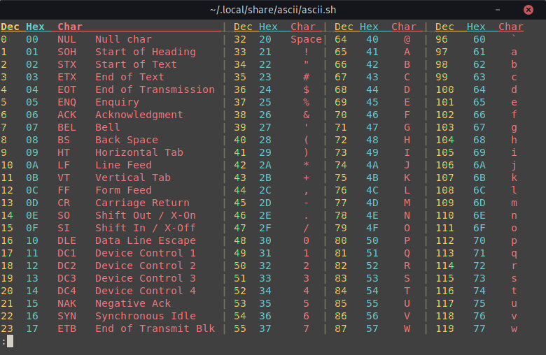

# Color ASCII-Table for Terminals

## Installation

Make sure you have `sed` and `less` installed.

Just clone it to a convenient directory like so:  
`git clone https://github.com/Dreistein/ascii.git ~/.local/share/ascii`  

Then add an alias to your shell configuration file:  
`alias ascii="~/.local/share/ascii/ascii.sh"`

Now you can view the table with
`ascii`  
Enjoy.

## Customization

To customize the colors, simply change the [ASCII Escape Codes](https://en.wikipedia.org/wiki/ANSI_escape_code) in the ascii.sh file.  
The following can be changed:
- HEAD -- Start of the Header
- DECIMAL -- Start of decimal value
- HEX -- Start of hex value
- CHAR -- Start of the ascii character
- SEPARATOR -- Separator separating columns
